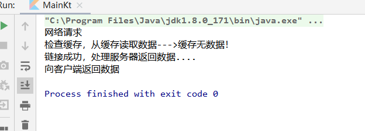

## **责任链设计模式**

### **介绍**
>使多个对象都有机会处理请求，从而避免了请求的发送者和接收者之间的耦合关系。将这些对象连成一条链，并沿着这条链传递该请求，直到有对象处理它位置。----《Android设计模式》

### **使用场景**
- 多个对象都可以处理这个请求，但具体哪个处理则在运行时决定。
- 在请求处理者不明确的情况下向多个对象中的一个提交请求
- 需要动态指定一组对象处理请求

### **UML**


### **使用示例**

在日常开发中网络请求基本都是会用到的，有时网络请求会用到缓存机制，如果本地没有缓存才会去请求网络数据，还有可能要拦截数据等操作。那么这种场景下就可以用责任链模式来进行开发。 

#### **定义拦截器抽象接口层**
实现链式调用的前提条件，要确保接收的请求和返回的响应，遵循统一的接口规范。只有这样，拦截器与拦截器之间，才能进行请求的向下派发或回滚，以及响应结果的拼接。
链式调用还需要确保每个拦截器接收到拦截链执行器，并在拦截器中调用执行器中的方法，从而使执行器再次创建，并使拦截器光标定位到下一个节点，从而触发下一个节点的拦截器。以此类推，最终形成一整套的链式调用。
因此，定义拦截器抽象层时，需要提供两个接口:

- 拦截器接口
    ```
    interface Interceptor {
        /**
        * 拦截请求
        */
        fun intercept(chain: Chain): String?
    }
    ```

- 拦截链处理接口 
    ```
    interface Chain {
        /**
        * 返回请求
        */
        fun request(): String?

        /**
        * 处理请求
        */
        fun process(request: String?): String?
    }
    ```

```Interceptor```是对拦截器的抽象接口定义，在```Intercept```方法中，将会接收一个```Chain```。而```Chain```就是拦截链的抽象定义，这样一来，当拦截器的具体实现在调用```Intercept```方法时，就可以通过```Chain```拦截链，调用```request```方法取出客户端请求，然后再调用```process```方法从而创建下一个节点的```Chain```，这时，在下一个节点的```Chain```中，将会定位到下一个```Interceptor```拦截器。

### **创建拦截链**

```
class RealInterceptorChain(
    var interceptors: ArrayList<Interceptor>,
    var index: Int,
    var request: String?
) : Chain {

    override fun request(): String? {
        return "$request\n"
    }


    override fun process(request: String?): String? {
        if (interceptors.isNullOrEmpty() || index >= interceptors.size) {
            return request
        }
        val next = RealInterceptorChain(interceptors, index + 1, request)
        //获取当前拦截器
        val interceptor = interceptors[index]
        //执行当前拦截器操作
        return interceptor.intercept(next)
    }
}
```

由于责任链模式的特点及设计思想，处理者的数量并不确定，也就是说，某个环节的处理过程，可能会随时发生改变，也可能整个处理流程都会发生变更。因此，对于拦截链的具体实现```RealInterceptorChain```来说，不能在其内部定义拦截器的具体实现，而是需要接收一个从客户端传入的拦截器集合。只有这样，当```RealInterceptorChain```被拦截器再次触发创建时，就可以根据当前拦截器集合以及光标索引，获取到下一个拦截器，并将其执行，最终形成链式调用。

在```process```方法中，每次调用该方法时都会创建```RealInterceptorChain```的```nex```t对象，并根据当前```index```光标索引，取出当前拦截器，执行```intercept```方法，并传入next。这样一来就可以在具体的```Interceptor```拦截器中，来决定是否需要继续调用```RealInterceptorChain```对象的```process```方法。如果继续调用此方法，则框架会继续执行下一个节点的拦截器，否则，将会终止，并直接向客户端返回结果。

### **定义一些拦截器**

- 缓存拦截器
    ```
    class CacheInterceptor : Interceptor {

        override fun intercept(chain: Chain): String? {
            var request = chain.request()
            request += "检查缓存，从缓存读取数据--->"
            request += "缓存无数据！"
            //假设这里没找到数据，向下一级请求
            //找到数据直接返回request
            return chain.process(request)
        }
    }
    ```

- 链接拦截器
    ```
    class ConnectInterceptor:Interceptor {
        override fun intercept(chain: Chain): String? {
            var request = chain.request()
            request += "链接成功，处理服务器返回数据...."
            //假设这里没找到数据，向下一级请求
            //找到数据直接返回request
            return chain.process(request)
        }
    }
    ```

- 结果拦截器
    ```
    class ResultInterceptor : Interceptor {
        override fun intercept(chain: Chain): String? {
            var request = chain.request()
            request += "向客户端返回数据"
            //找到数据，直接返回
            return request
        }
    }
    ```

### **拦截器调用**
```
fun main() {
    var request = "网络请求"
    var interceptors = arrayListOf<Interceptor>()
    interceptors.add(CacheInterceptor())
    interceptors.add(ConnectInterceptor())
    interceptors.add(ResultInterceptor())
    //
    val realInterceptorChain = RealInterceptorChain(interceptors, 0, request)
    println(realInterceptorChain.process(request))
}
```

### **执行结果**




## **优点和缺点**

### 优点
 - 对请求者进行解耦，提高代码的灵活性

 ### 缺点
 - 由于需要对请求者遍历，处理请求者太多或者请求者的自己逻辑里有太多繁重任务那么肯定会影响性能。
